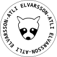
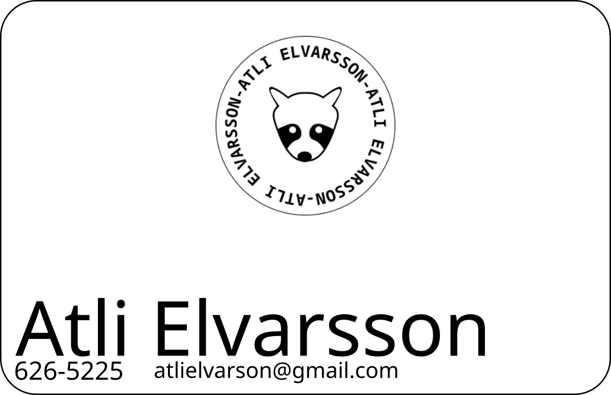

# Verkefni 2 - Inkscape og Laserskurður

##  Verkefni 2.1 - Logo í Inkscape
Ég byrjaði á því að Búa til hring með Ellipse tólinu.
Ég gerði hringinn hvítan á litinn með rauðri útlínu.
> Útlínan er 2mm á breidd.

Síðan teiknaði ég Þvottabjörn upp eftir mynd sem ég fann á netinu. Ég notaði Bezier-curve tólið til þess að teikna þvottabjörninn. Síðan notaði ég ''path --> union' til þess að líma allar línurnar í birninum saman.

Næst teiknaði ég annan hring sem var minni, Ég gerði hann gegnsæjann með enga útlínu. Svo skrifaði ég texta með nafninu mínu. Síðan valdi ég textann og hringinn og fór í
>text put on path til að vefja textann utan um hringinn.

##  Verkefni 2.2 - Nafnspjald

Ég teiknaði fyrst upp nafnspjaldið í Inkscape, það var 85mm * 55 mm á stærð. ég teiknaði kassa sem var það stór og gaf honum 5mm radíus á hornin.
Ég setti eftirfarandi upplýsingar á spjaldið:
>logoið sem ég bjó til áðan, nafnið mitt, símanúmer og netfang.

### Laserskurður
Til þess að laserskerinn gæti skilið myndina þurfti ég að breyta logoinu í .png (sem stendur fyrir portable network graphics) mynd af því að logoið er samsett ú mörgum mismunandi formum sem laserskerinn hefði reynt að skera út vitlaust. Með því að fletja út myndina í .png getur laserskerinn skorið myndina rétt út. Síðan þurfti að breyta textanum í path svo að laserskerinn gæti skilið að hann ætti að skera textann.
Næst var loksins komið að því að skera spjaldið út.

